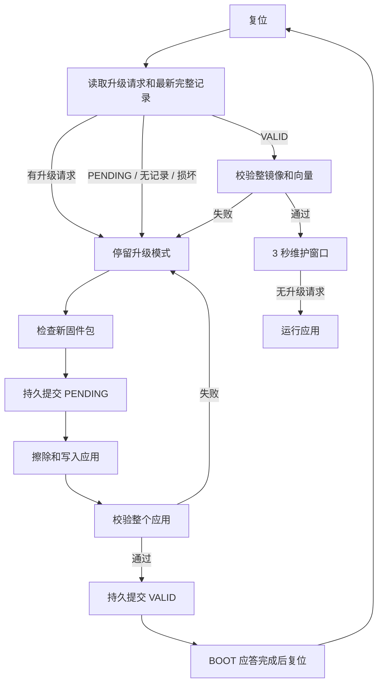

# USB / UART 固件升级设计

设计日期：2026-10-01。对象：AT32F423KCU7-4 / LSM6DSV 工程及现有网页上位机。

**本文是待实现的设计规格。界面样稿使用模拟设备，不会打开串口或烧写固件。** 现有 Bootloader v1 可以分包升级，但不能保证断电后拒绝启动半写入应用。下面的 Bootloader v2、固件包和网页升级流程需要一并实现、验证后才能使用。

后续实测更新：当前 v1 Boot 已在本板完成首次 SWD 安装、UART 应答阻塞修复及完整 USB/UART 上传、启动、回读验证，见 [实板验证](firmware-upgrade-hardware-validation.md)。这些通过项不代表本文 v2 方案已经实现。

当前可用网页版已于同日发布 `20261001fw1`，使用 `.bin` 和现有v1协议，完成UART网页实板上传、校验、自动重连和独立回读，见 [网页升级验证](web-firmware-upgrade-validation.md)。本文的持久状态、`.atfw`及v2重试语义仍是后续设计。

## 1. 推荐方案

保留现有自定义 Bootloader，用同一套升级协议支持 USB CDC 和 USART4。网页增加「固件升级」页：选择固件包 → 检查兼容性 → 进入升级模式 → 上传与验证 → 自动重连 → 核对版本和原配置。

第一版采用 **单应用分区 + 两份持久升级状态记录**。升级中断后设备保持在 Bootloader，可从头重新上传；保留全部 208 KiB 应用容量。此方案不提供旧固件自动回滚，也不在断电后从上次偏移续传。丢失单个应答可以重试同一个数据包。

当前板上应用为 74,048 字节；本次六面校准九轴评审构建为 78,136 字节，尚未烧写。双 104 KiB 固件槽虽然暂时容得下，但会缩小后续容量，并增加镜像搬移和中断恢复逻辑，因此不作为第一版。

| 项目 | 设计决定 |
| --- | --- |
| USB | 原 USB CDC，PA11 / PA12，沿用 COM 通道 |
| UART | USART4，PA0 TX / PA1 RX，2,000,000 baud，8N1 |
| 普通操作 | 网页选择 `.atfw` 固件包，点击一次「开始升级」 |
| 配置 | 保留节点、融合模式、量程、输出频率、CAN、启动校准参数 |
| 校准 | 保留加速度校准和陀螺零偏历史扇区 |
| 恢复 | 未完成或校验失败：停留升级模式，重传整个镜像 |
| 首次安装 | 一次 SWD 更新兼容 Bootloader、应用和有效状态记录 |
| 后续升级 | USB / UART 只写应用与升级状态，不更新 Bootloader |

CRC 用于发现传输/存储损坏；这版不声称具备签名验证或安全启动能力。

## 2. 工程现状与需要补齐的部分

已核对 `bootloader/src/main.c`、`bl_protocol.c`、`bl_io.c`、`inc/config/boot_request.h`、应用协议及网页串口逻辑。

| 当前行为 | v2 要求 |
| --- | --- |
| 应用命令 `0x16` 写 RAM 标记再复位 | 保留；进入 Boot 后优先消费标记 |
| RAM 标记 `0x2000BFF0`，栈预留 16 字节 | Boot / 应用统一链接约定，首次安装共同更新 |
| v1 每包最多 256 字节，整包 CRC32 | 保留块大小，增加头部保护与应答关联 |
| 有效性判断主要依赖 SP / Reset 向量 | 启动还要检查持久状态和整个应用 CRC |
| 擦除期间升级状态只存在 RAM | 擦除前先持久写入 PENDING |
| USB / UART 合并输入，回复广播到两端 | 每端独立解析，回复原通道，写入会话独占 |
| 脚本在复位后继续使用原打开串口 | 网页关闭旧句柄、等待端口重现并核对 MCU UID |
| 普通复位自动重连 | 升级控制器临时独占串口，避免普通重连抢占 |

近期板上完整 Flash 备份的启动向量与当前 Bootloader 构建产物不同，不能假定板上 Bootloader 已支持当前源码的全部行为。现有 USB / UART 完整升级链路也尚未完成板级验证。

## 3. Flash 分区与掉电保护

Flash 为 256 KiB，扇区为 2 KiB。地址表的结束地址均为包含式。

| 起始地址 | 结束地址 | 大小 | 用途 |
| --- | --- | --- | --- |
| `0x08000000` | `0x08007FFF` | 32 KiB | Bootloader，仅首次 SWD 安装 |
| `0x08008000` | `0x0803BFFF` | 208 KiB | 应用，唯一允许上传的区域 |
| `0x0803C000` | `0x0803C7FF` | 2 KiB | 原加速度校准，保留 |
| `0x0803C800` | `0x0803CFFF` | 2 KiB | **新增升级状态槽 A** |
| `0x0803D000` | `0x0803D7FF` | 2 KiB | 原设备配置槽 0，保留 |
| `0x0803D800` | `0x0803DFFF` | 2 KiB | 原设备配置槽 1，保留 |
| `0x0803E000` | `0x0803E7FF` | 2 KiB | **新增升级状态槽 B** |
| `0x0803E800` | `0x0803EFFF` | 2 KiB | 原陀螺零偏历史槽 0，保留 |
| `0x0803F000` | `0x0803F7FF` | 2 KiB | 空闲，暂不占用 |
| `0x0803F800` | `0x0803FFFF` | 2 KiB | 原陀螺零偏历史槽 1，保留 |

源码搜索与近期全 Flash 备份均显示 C800、E000、F000 空闲。迁移工具仍须逐板检查：槽中若既非全 `0xFF`，也非可识别升级记录，应停止迁移，不能直接擦除。

### 3.1 固定 128 字节升级记录

每槽只存一条记录，余下字节保持 `0xFF`。全字段小端；生成记录时先填写字段和 CRC，**最后写提交字**，然后读回验证。

| 偏移 | 长度 | 字段 |
| --- | --- | --- |
| 0 | 4 | magic = `0x324D4C42`，字节为 `BLM2` |
| 4 | 2 | record_format = 2 |
| 6 | 2 | record_bytes = 128 |
| 8 | 4 | generation，递增记录序号 |
| 12 | 4 | state：1 = PENDING，2 = VALID |
| 16 | 4 | board_id |
| 20 | 4 | image_base，固定 `0x08008000` |
| 24 | 4 | image_size，8…212,992 |
| 28 | 4 | image_crc32 |
| 32 | 4 | firmware_version |
| 36 | 4 | build_id |
| 40 / 42 | 各 2 | settings_min / settings_max |
| 44 / 46 | 各 2 | hardware_min / hardware_max |
| 48 | 4 | minimum_boot_version |
| 52 | 32 | 镜像 SHA-256，来自已校验固件包头 |
| 84 | 4 | update_session |
| 88 / 90 | 各 2 | acc_cal_min / acc_cal_max |
| 92 | 28 | reserved，必须全 `0xFF` |
| 120 | 4 | record_crc32，覆盖字节 0…119 |
| 124 | 4 | commit = `0x324B4F42`，字节为 `BOK2` |

记录须同时通过 magic、版本、长度、保留字段、提交字、记录 CRC、型号和应用边界检查，才是完整记录。用模 2³² 的序号比较选最新完整记录；两个完整记录序号差恰为 2³¹ 或同序号内容冲突时，保持升级模式并报错。

### 3.2 写入顺序

1. 校验固件包、型号、配置兼容性和完整应用边界；此时不擦除应用。
2. 将 `PENDING(generation + 1)` 写到最新记录的另一槽，提交并读回。失败则停止，应用不动。
3. **只有 PENDING 已持久提交后**，才允许擦除应用区域。逐扇区擦除，期间服务串口和 USB。
4. 连续接收 DATA，写入并读回每块；只在验证成功后确认下一个偏移。
5. END 检查完整大小、整镜像 CRC32、向量与镜像内 Reset_Handler 范围。
6. 在另一个槽写 `VALID(generation + 1)`，最后提交并读回；失败则保持 PENDING。
7. 返回验证成功；收到 BOOT 后完成应答发送，再复位，按同一启动检查进入应用。

最新完整记录为 PENDING 时，即使旧 VALID 仍存在，也不能启动旧应用。写 VALID 时断电会留下已提交 PENDING；写 PENDING 时断电、且应用尚未擦除，原 VALID 仍可通过整镜像 CRC 检查。

每次启动都检查最新完整记录；只有 VALID 且实际 Flash 的完整 CRC、型号和向量均匹配，才允许进入应用。两个槽都无完整记录时保持 Boot，**不能退回「只看向量」启动**。首次安装负责创建初始有效记录。

## 4. 固件包 `.atfw`

普通界面只接收 `.atfw`，拒绝 Bootloader 镜像、整 Flash 镜像及裸 `.bin`。固件包由构建工具生成，为 **128 字节头 + 应用原始 bin**，不压缩。文件实际长度必须等于 `128 + image_size`，不接受尾随内容。

| 偏移 | 长度 | 字段 |
| --- | --- | --- |
| 0 | 8 | magic = ASCII `AT32FW2` + `00` |
| 8 / 10 | 各 2 | format = 2 / header_bytes = 128 |
| 12 | 4 | board_id |
| 16 / 18 | 各 2 | hardware_min / hardware_max |
| 20 | 4 | minimum_boot_version |
| 24 | 4 | firmware_version |
| 28 | 4 | build_id |
| 32 | 4 | image_base = `0x08008000` |
| 36 | 4 | image_size |
| 40 | 4 | image_crc32，覆盖原始 bin，不含最后字的 FF 补齐 |
| 44 / 46 | 各 2 | 可读取配置版本 settings_min / settings_max |
| 48 | 32 | 原始 bin 的 SHA-256 |
| 80 | 4 | feature_flags：bit 0 九轴融合、bit 1 CAN、bit 2 应用加速度校准；其余为 0 |
| 84 / 86 | 各 2 | 可读取加速度校准格式 acc_cal_min / acc_cal_max |
| 88 | 36 | reserved，必须全 `0xFF` |
| 124 | 4 | header_crc32，覆盖字节 0…123 |
| 128 | image_size | 应用 bin |

所有整数小端。版本打包为 `major << 16 | minor << 8 | patch`，major 为 16 位，minor / patch 各 8 位；比较按数值。`build_id` 由发布流程提供唯一 32 位编号，同版本不同 build 也应显示区分。

本工程拟用 `board_id = 0x04230001`，其常量需在 Boot、应用和打包工具共同定义。尚未标定硬件修订时用 revision = 0，包的硬件区间须显式包含 0，不能把 0 当作任意型号通配符。

网页先检查头、长度、CRC32、SHA-256 和向量；Boot 再独立检查头、兼容性、每包 CRC 和写入后的整镜像 CRC。Boot 存储包中的 SHA 供追踪，这版不要求在 MCU 运行 SHA-256 验证算法。

向量检查至少包括：初始 MSP 为 8 字节对齐、处于 `0x20000000 < MSP <= 0x2000BFF0`；Reset_Handler 的 Thumb 位为 1，清除该位后位于 `image_base` 到 `image_base + image_size` 的镜像内部。包最短 8 字节只满足向量长度，实际代码是否可用仍由构建与实板启动验证保证。

配置当前持久格式是 v6。新应用只有声明并确实能读取现存格式时才能升级；不兼容包在 BEGIN 前拒绝。同版本重刷允许；降级默认不提供自动入口，不能通过降级绕过配置兼容性检查。

还要检查配置语义和校准格式：现存九轴模式要求目标具备九轴能力，正在使用 CAN 要求目标具备 CAN 能力；已保存加速度校准要求目标支持应用校准且能读取其格式。六面校准并行改动采用追加记录 v2，并兼容原 v1；两者的 CRC 均沿用原加速度记录的未最终取反约定，不能误用本升级协议的最终取反 CRC。未知/损坏校准记录不能默默清零。无有效校准且扇区全空白时，acc_cal_schema = 0，不要求包声明兼容一个不存在的记录。

## 5. Bootloader v2 传输协议

### 5.1 请求和应答使用同一帧结构

| 偏移 | 长度 | 字段 |
| --- | --- | --- |
| 0 | 2 | magic = `42 4C`（BL） |
| 2 | 1 | wire_version = 2 |
| 3 | 1 | command；应答为 command OR `0x80` |
| 4 | 2 | sequence |
| 6 | 4 | session；HELLO 和旁路只读 STATUS 可为 0 |
| 10 | 4 | offset，相对应用起始地址 |
| 14 | 2 | payload_length，0…256 |
| 16 | 2 | reserved = 0 |
| 18 | 4 | frame_crc32 |
| 22 | 可变 | payload |

帧 CRC 覆盖「字节 0…17 + payload」，不含字节 18…21。CRC 为 IEEE / zlib CRC32，poly `0xEDB88320`，初值和最终异或均 `0xFFFFFFFF`。

应答 payload 前四字节为 `status:u16 + detail:u16`，其后为命令数据。应答须回显 command、sequence、session；offset 为当前已确认的下一字节。主机仅接受匹配当前请求的应答，其他应答不改变进度。

主机单请求在途；sequence 从 1 递增并允许 16 位回绕。每次新升级选择随机非零 32 位 session，这只是请求关联标识，不是身份认证。

### 5.2 命令

| 命令 | 值 | 请求 payload | 行为 |
| --- | --- | --- | --- |
| HELLO | `0x01` | 空 | 返回 Boot 能力、UID、配置格式和镜像状态；只读 |
| BEGIN | `0x02` | `.atfw` 的 128 字节头 | 再检查兼容性，提交 PENDING；应答接受后逐扇区擦除 |
| DATA | `0x03` | 1…256 字节应用数据 | 仅 RECEIVING，按连续偏移写入、读回，再应答 |
| END | `0x04` | 空 | 大小/CRC/向量检查，然后提交 VALID |
| ABORT | `0x05` | 空 | 当前 Flash 操作结束后停止、释放会话；保留 PENDING |
| BOOT | `0x06` | 空 | 只有完整 VALID 应用才可接受；发送完成后复位 |
| STATUS | `0x07` | 空 | 返回阶段和已确认偏移；只读查询 |

BEGIN 接受不表示擦除完成；主机以 STATUS 等待 RECEIVING 后发送 DATA。END 接受后进入 VERIFYING；主机等待 STATUS 到 READY_TO_BOOT 且镜像标识匹配，不能将「收到 END」当作升级成功。Boot 应按 Flash 扇区和 CRC 小段调度，避免长时间阻塞 USB 服务。

阶段编号：0 IDLE、1 ERASING、2 RECEIVING、3 VERIFYING、4 COMMITTING、5 READY_TO_BOOT、6 RECOVERY。STATUS 命令数据为 16 字节：`phase:u8, image_state:u8, reserved:u16, next_offset:u32, image_size:u32, last_error:u32`。镜像状态：0 NONE、1 PENDING、2 VALID、3 CORRUPT。

HELLO 命令数据固定 80 字节：

| 偏移 | 字段 |
| --- | --- |
| 0 / 4 / 8 | boot_version:u32 / supported_wire_mask:u32 / board_id:u32 |
| 12 / 14 | hardware_revision:u16 / stored_settings_schema:u16 |
| 16 | UID[12]，MCU 唯一标识，原字节顺序 |
| 28 / 32 | app_base:u32 / app_capacity:u32 |
| 36 / 38 | max_chunk:u16 / sector_bytes:u16 |
| 40 / 41 / 42 | image_state:u8 / phase:u8 / capability_flags:u16 |
| 44 / 48 | active_firmware_version:u32 / active_build_id:u32 |
| 52 / 56 | active_image_size:u32 / active_image_crc32:u32 |
| 60 / 64 / 68 | confirmed_bytes:u32 / generation:u32 / owner_session:u32 |
| 72 / 73 / 74 | settings_storage_state:u8 / last_error:u8 / acc_cal_schema:u16 |
| 76 / 77 | acc_cal_storage_state:u8 / reserved[3]=0 |

`supported_wire_mask` 的 bit 2 表示 v2。能力 bit 0 = 持久提交、bit 1 = UID、bit 2 = 独占会话、bit 3 = 状态查询；网页要求四项均具备。配置与加速度校准存储状态共用枚举：0 空白、1 校验有效、2 损坏、3 未识别。只有空白或已识别有效存储可以通过普通升级预检查；空白 schema = 0，配置使用目标应用默认值，校准使用单位比例/零偏。损坏/未知数据不自动擦除或还原默认值。

HELLO 的 `active_*` 字段仅在 image_state = VALID 且实际镜像复核通过时有效，其他状态返回 0；PENDING 的目标大小与进度通过 STATUS 返回。不能把旧 VALID 记录里的版本当成已经可以启动的应用版本。

状态码：0 OK、1 BAD_FRAME、2 BAD_PARAM、3 CRC_ERROR、4 FLASH_ERROR、5 NO_APP、6 BUSY、7 BOARD_MISMATCH、8 BOOT_TOO_OLD、9 OFFSET_MISMATCH、10 WRONG_STATE、11 CONFIG_INCOMPATIBLE、12 SESSION_MISMATCH、13 IMAGE_SIZE、14 IMAGE_VERIFY、15 WIRE_VERSION。detail 为具体阶段或内部错误子码，接口不向用户直接显示数字。

### 5.3 重试、独占与取消

- USB / UART 各有独立解析器和接收缓冲，不能将两端字节拼成一帧。应答只发请求通道。
- BEGIN 后绑定「物理通道 + session」，另一通道只允许 HELLO / STATUS，所有写操作返回 BUSY。
- DATA 应答丢失时重发相同包：偏移、长度和 Flash 内容均一致就回 ACK，不重复写。超前偏移报 OFFSET_MISMATCH 并返回实际偏移；内容不同报错，不能覆盖已写块。
- 同 session、相同包头的重复 BEGIN 只返回当前状态，**不能再次擦除**。新 session 只能在无所有者时开始。
- 重复 END 在校验中返回阶段；完成后返回原结果。BOOT 应答丢失后先查询状态或尝试连接应用，不能重新 BEGIN 擦除已完成镜像。
- 在正常 BEGIN / END 响应中明确报告接受阶段，轮询 STATUS 直至最终阶段。DATA 超时 1.5 秒，同包最多重试 5 次；擦除预算 30 秒、验证预算 10 秒，均须实板测量后调整。
- 主机每 500 ms 查询长阶段。设备 10 秒未收到有效所有者请求，或 USB 断开，完成当前 Flash 操作后进入 RECOVERY 并释放所有者。传输中不能依赖页面卸载时一定能发出 ABORT。
- ABORT 前若从未提交 BEGIN，可启动原有效应用；BEGIN 已接受后停止则保留 PENDING，提示用户重新上传完整固件。
- 连线中断且设备仍为 PENDING 时，从偏移 0 新开会话重传；若设备报告相同镜像已 VALID，仅继续 BOOT 和应用核对。

非末块长度必须为 4 的倍数；末块不足一个字补 `0xFF`，CRC 和计数只包含实际镜像长度。检查范围必须用减法/容量比较避免整数溢出；不能依靠 `base + length` 的溢出结果判断安全。

v2 所有超时统一使用可回绕的 32 位毫秒计时与差值比较。不能直接使用 `DWT->CYCCNT / cycles_per_ms` 作为长时间单调时钟；现有启动窗口的实现需要一并改为毫秒时基，或正确累计 DWT 回绕，否则维护等待超过一个周期会误判。

## 6. 应用与网页串口生命周期

### 6.1 应用增加固件信息查询

预留命令 `0x23 QUERY_FIRMWARE_INFO` 和消息 `0x09 FIRMWARE_INFO`，保留现有协议序号与 CRC16。64 字节 payload：

| 偏移 | 字段 |
| --- | --- |
| 0 / 1 / 2 | format:u8=1 / expected_boot_wire:u8=2 / flags:u16 |
| 4 / 8 / 10 | board_id:u32 / hardware_revision:u16 / settings_schema:u16 |
| 12 / 16 / 20 | firmware_version:u32 / build_id:u32 / minimum_boot_version:u32 |
| 24 | UID[12] |
| 36 / 40 / 44 | image_base:u32 / image_size:u32 / image_crc32:u32 |
| 48 / 50 | acc_cal_schema:u16 / reserved[14]=0 |

运行中应用从有效升级记录读取镜像大小/CRC，版本须与本次编译版本一致；不能在自身 bin 内嵌未经定义的「自包含 CRC」。flags bit 0 表示该信息与有效升级记录一致，bit 1 表示当前应用加载了有效加速度校准，其余位暂为 0。应用声明的 expected_boot_wire 不证明实际 Boot 版本，进入 Boot 后仍须 HELLO 核实。

Boot 只读取配置槽的格式与 CRC，不写配置、也不执行配置迁移；兼容迁移由新应用处理。配置字段核对按语义值比较，不能仅比较配置 Flash 的原始字节，因为合法迁移会改变格式和记录序号。

### 6.2 升级流程

1. 选择包，在内存完成全部预检查；查询当前固件和配置，缓存 UID、已授权端口、配置快照及原输出状态。
2. 如果页面有尚未保存的配置，先要求保存或放弃该草稿，再开放「开始升级」。避免把界面草稿误认为设备已保存配置。
3. 升级控制器取得串口独占权：停掉采集、设置轮询、普通重连，清理在途写入。
4. 发送现有 `0x16` 请求进入 Boot；应答可能因复位丢失，以新 Boot 的 HELLO 为准。
5. 关闭原 reader/writer、释放锁并关闭端口；重新打开已授权端口，完成 v2 HELLO。
6. 核对 **完整 12 字节 UID、board_id、硬件修订、配置兼容性和 Boot 能力** 后才允许 BEGIN。
7. 执行 BEGIN / STATUS / DATA / END / STATUS / BOOT；每包进度按 ACK 确认字节计算。
8. 再释放 Boot 端口锁并等待应用端口；查询固件信息，核对 UID、目标版本/build/镜像 CRC，再读取配置。
9. 版本匹配且配置语义核对通过，才显示「升级完成，配置已保留」，恢复原采集状态和普通重连控制。

USB 复位可能重新枚举，COM 号可以改变。浏览器 `SerialPort.getInfo()` 提供的 VID/PID 不足以识别具体板子；即使描述符带 UID 派生序列号，网页仍要通过协议读取 UID。

优先重开原已授权端口；必要时对已授权候选端口逐个进行只读 HELLO，只有 UID 一致才使用。不会仅凭 VID/PID 相同就写入另一块板。若新端口没有浏览器授权，20 秒后显示「重新选择设备」，由用户点击触发系统端口选择；选择后仍核对 UID。`getPorts()` 获取已授权端口、`requestPort()` 需要用户手势，遵循 [Chrome Web Serial 官方说明](https://developer.chrome.com/docs/capabilities/serial)。端口被其他软件占用时，提示关闭占用软件并重试，不尝试强制关闭其他程序。

应用恢复等待预算为 90 秒，可容纳现有较长初始化零偏过程。等待时明确显示「设备初始化中」，不能仅因首个姿态帧较慢就判定刷写失败。升级后旧输出协议即使是 JustFloat / 非姿态流，也用固件信息和配置查询判断成功，不能依赖收到 Euler 数据。

串口正常读循环与 Boot 读循环不能同时运行。沿用现有关闭顺序：停止调度 → cancel reader → 等待读循环释放 → 收敛/取消写入 → release writer → close port。错误出口也必须释放独占权；处于 PENDING 时维持专用恢复界面，不能恢复普通采集。

## 7. 上位机界面与恢复文案

交互样稿：`docs/firmware-upgrade-preview.html`。所有设备、版本、端口、进度均为演示数据。

新增「固件升级」页面，显示当前设备/版本、目标固件/版本和保留配置摘要。普通用户不需要选择地址、擦除范围、分包大小或协议。

页面阶段为：检查固件 → 进入升级模式 → 连接升级设备 → 写入固件 → 验证固件 → 重启并重连 → 核对版本与配置。传输 100% 时仍显示「传输完成，正在验证」，不会提前显示升级成功。

| 情况 | 页面结果与动作 |
| --- | --- |
| 型号/配置格式不兼容 | 「固件不适用于当前设备」，开始按钮禁用；应用继续运行 |
| 旧 Boot 不支持 v2 | 「需要先安装新版升级程序」，提供本地维护说明；不降级成危险写入 |
| USB 新端口尚未授权 | 「设备端口已变化」，显示「重新选择设备」；选错 UID 拒绝 |
| 传输断开或掉电 | 「升级未完成，设备等待恢复」，显示「重新连接并重传」 |
| 校验失败 | 「固件验证失败」，保留 Boot；可重新选择正确固件后重传 |
| 开始前取消 | 返回正常设备页 |
| 开始后停止 | 「设备将停留升级模式，需要完整重新上传」 |
| 已 VALID 但应用重连超时 | 「固件已写入，尚未连接到应用」，提供重连；不盲目再次擦除 |
| 目标版本匹配、配置核对异常 | 「固件更新成功，配置核对异常」，显示差异；不自动覆盖配置 |
| 全部核对通过 | 「升级完成，配置已保留」，显示新版本、连接端口 |

## 8. 首次部署与实现拆分

首次迁移不能用旧 v1 应用更新协议覆盖 Bootloader。维护工具先备份整片 Flash 和 UID，检查现有保留区域；通过 SWD 安装 v2 Boot、配套应用，并在核实应用 CRC 后写入初始 VALID 记录。逐扇区写指定区域，禁止整片擦除；结束后比较配置/校准区域与备份一致。

没有记录的 v2 Boot 必须保持维护模式。因此迁移中断不会跳进未确认应用，维护人员可以 SWD 重做安装或使用 v2 上传正确应用。

| 模块 | 计划文件/责任 |
| --- | --- |
| 共享规格 | 新增 `inc/config/firmware_identity.h`、布局/版本/board_id 常量 |
| Boot 状态 | 新增 `bootloader/src/bl_metadata.c`，双槽记录、启动 CRC、提交顺序 |
| Boot 协议 | 更新 `bl_protocol.*`：v2、会话、状态、重试幂等 |
| Boot 通道 | 更新 `bl_io.*`：分通道接收/应答、USB 断开事件 |
| 应用入口 | 固件信息查询、保留 RAM 邮箱、ACK 发送与复位协调 |
| 打包工具 | 新增 `tools/firmware_pack.py`：从应用 bin 生成/检查 `.atfw` |
| 维护脚本 | 新增 v2 CLI；现有 v1 脚本明确标注 legacy，不混用 |
| 网页传输 | 新增独立包解析/帧解析/升级控制模块，接入现有串口所有权 |
| 网页入口 | 现有设置页增加固件升级入口和恢复状态，不改日常姿态预览 |

阶段一完成包生成、Boot 状态保护、v2 CLI 和原生回归；阶段二完成网页流程与模拟串口；阶段三完成实板 USB/UART 全流程和断电验证后再发布。

## 9. 验收清单

所有测试记录实际固件版本、UID、传输通道和校准/配置区域前后校验结果。

| 类别 | 必须通过的检查 |
| --- | --- |
| 正常升级 | USB 与 UART 分别完成升级，重启后版本/CRC 匹配，全部原配置/校准保留 |
| 安装迁移 | 板上旧 Boot 一次 SWD 升级成功；未知保留扇区拒绝自动擦除 |
| Flash 边界 | 首/末字、非 4 字节末块、最大 208 KiB；超界、整 Flash/Boot 镜像拒绝 |
| 解析 | 截断头、巨大 payload、噪声、版本错误、帧 CRC 错误均不越界或写入 |
| 应答关联 | 旧序号/旧 session 不推进；ACK 丢失、重复 DATA/BEGIN/END 不重复擦写 |
| 通道独占 | 两个口同时发送时不混帧，另一口无法抢占写入 |
| 元数据掉电 | 在每次槽擦除、字段写入、CRC 写入、提交字写入前后注入复位 |
| 应用掉电 | PENDING 后、首扇区/末扇区擦除、首包/中间/末包、END 和 BOOT 前后断电 |
| 恢复原则 | 未完整提交且 CRC 不通过时永不启动应用；恢复后可重新完整上传 |
| 端口变化 | COM 号变化、未授权端口、端口占用、多个同型号设备、选错 UID |
| 页面异常 | 刷新/关闭/停止、隐藏标签页计时延后、断线；设备保持可恢复 |
| 启动状态 | 快速启动与长初始化、不同输出协议；不依赖姿态帧确认升级 |
| 配置兼容 | 格式 v6 保留和目标兼容迁移；不兼容升级/降级在擦除前拒绝 |
| 校准并行改动 | 六面加速度校准完成后，升级前后参数及校准有效标志保持一致 |

本设计中的时限是初始工程参数，不是实测速度保证。完成上述验证前，网页样稿不能作为真实升级工具使用。

## 10. 本次设计验证

独立样稿已通过浏览器交互检查：USB / UART 正常流程、USB 新端口授权、选错设备拒绝、中断后完整重传、掉电提示、验证失败、配置不兼容、旧 Boot 拦截、主动停止和配置差异提示。检查了 1440 / 820 / 620 / 390 / 360 像素宽度，页面无横向溢出。

结果和桌面/手机截图位于 `artifacts/firmware-upgrade-design/`。这些检查只验证交互样稿，不验证真实升级协议、实际断电恢复或设备刷写；本次没有安装新 Boot、烧写设备或发布上位机。
